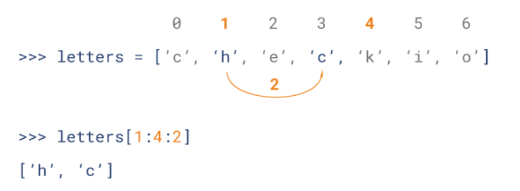

# 数据类型

Python 定义了一些标准类型，用于存储各种类型的数据。

Python有如下的数据类型：

- Numbers（数字）（int, long, float, complex）

- String（字符串）

- List（列表）

- Tuple（元组）

- Set（集合）

- Dictionary（字典）

- boolean（True, False）

列表，元组，集合，字典的区别如下表所示：

|  | 列表         | 元组 | 集合 | 字典 |
| ----------- | ----------- | ----------- | ----------- | ----------- |
| 英文    | list       | tuple      | set       | dict      |
| 可否读写 | 读写       | 只读      | 读写       | 读写      |
| 可否重复 | 是       | 是      | 否       | 是      |
| 存储方式 | 值       | 值      | 键（不能重复）|  键值对（不能重复） |
| 是否有序 | 有序       | 有序      | 无序       | 无序      |
| 初始化 | [1, 'a'] | (1, 'a') | set([1, 'a'])或{1, 'a'} | {'a':1, 'b':2} |
| 添加  | append       | 只读  | add  | d['key']='value' |
| 读元素 | res[2:] | t[0] | 无  | d['a']  |

## 字符串

Python的字符串示例如下：

<details>
<summary>示例如下，点击展开</summary>

```python
>>> str_1 = 'this is string 1 '
>>> str_2 = "this is string 2 "
>>> str_3 = '''this is string 3'''
>>> str_1
'this is string 1 '
>>> str_2
'this is string 2 '
>>> str_3
'this is string 3'
>>> type(str_1)
<class 'str'>
>>> type(str_2)
<class 'str'>
>>> type(str_3)
<class 'str'>
```

</details>

python的字串列表有2种取值顺序:

- 从左到右索引默认0开始的，最大范围是字符串长度少1
- 从右到左索引默认-1开始的，最大范围是字符串开头

如下所示：

|| s | t | r | i | n | g |
|---|---|---|---|---|---|---|
|从左到右| 0 | 1 | 2 | 3 | 4 | 5 |
|从右到左|-6 |-5 |-4 |-3 |-2 |-1 |

如果想从字符串中截取子字符串，可以使用`[头下标:尾下标]`来截取相应的子字符串，其中下标是从 0 开始算起，可以是正数或负数，下标可以为空表示取到头或尾。

`[头下标:尾下标]`获取的子字符串包含头下标的字符，但不包含尾下标的字符。即含头不含尾。

<details>
<summary>示例如下，点击展开</summary>

```python
str = 'Hello World!'
 
print(str)           # 输出完整字符串
print(str[0])        # 输出字符串中的第一个字符
print(str[2:5])      # 输出字符串中第三个至第六个之间的字符串
print(str[2:])       # 输出从第三个字符开始的字符串
print(str * 2)       # 输出字符串两次
print(str + "TEST")  # 输出连接的字符串

# 输出结果如下
Hello World!
H
llo
llo World!
Hello World!Hello World!
Hello World!TEST
```

</details>

Python 列表截取可以接收第三个参数，参数作用是截取的步长，以下实例在索引 1 到索引 4 的位置并设置为步长为 2（间隔一个位置）来截取字符串：



## 列表

列表支持字符，数字，字符串甚至可以包含列表（即嵌套列表）。

列表中值的切割也可以用到变量 `[头下标:尾下标]` ，就可以截取相应的列表，从左到右索引默认 0 开始，从右到左索引默认 -1 开始，下标可以为空表示取到头或尾。

用法如下：

<details>
<summary>点击展开代码</summary>

```python
list = [ 'runoob', 786 , 2.23, 'john', 70.2 ]
tinylist = [123, 'john']

print(list)               # 输出完整列表
print(list[0])            # 输出列表的第一个元素
print(list[1:3])          # 输出第二个至第三个元素 
print(list[2:])           # 输出从第三个开始至列表末尾的所有元素
print(tinylist * 2)       # 输出列表两次
print(list + tinylist)    # 打印组合的列表

# 输出结果如下
['runoob', 786, 2.23, 'john', 70.2]
runoob
[786, 2.23]
[2.23, 'john', 70.2]
[123, 'john', 123, 'john']
['runoob', 786, 2.23, 'john', 70.2, 123, 'john']
```

</details>

<details>
<summary>点击展开代码</summary>

```python
res = [1,2,'yihang']

#增加元素：extend和append
res.append(1)
res.extend('6')

#删除元素：del，pop，切片，remove
del res[1]
res.pop(1) #删除该位置上的元素，没有指定则是最后一个元素
res = res[:2]+res[3:] #切片
res.remove(2) #删除指定值的元素

#更改元素
res[1] = 100 #

#查元素
print(res[0])
print(res[1]) 
```

</details>

## 元组

元组是另一个数据类型，类似于 List（列表）。

元组用 `()` 标识。内部元素用逗号隔开。但是元组是一个只读列表，不能修改。

用法如下：

<details>
<summary>点击展开代码</summary>

```python
my_tuple = ( 'runoob', 786 , 2.23, 'john', 70.2 )
tinytuple = (123, 'john')
 
print(my_tuple)               # 输出完整元组
print(my_tuple[0])            # 输出元组的第一个元素
print(my_tuple[1:3])          # 输出第二个至第四个（不包含）的元素 
print(my_tuple[2:])           # 输出从第三个开始至列表末尾的所有元素
print(tinytuple * 2)          # 输出元组两次
print(my_tuple + tinytuple)   # 打印组合的元组
```

</details>

<details>
<summary>点击展开代码</summary>

```python
>>> zoo=('wolf','elephant','penguin')
>>> zoo.count('penguin')
1
>>> zoo.index('penguin')
2
>>> zoo.append('pig')
Traceback (most recent call last):
  File "<stdin>", line 1, in <module>
AttributeError: 'tuple' object has no attribute 'append'
>>> del zoo[0]
Traceback (most recent call last):
  File "<stdin>", line 1, in <module>
TypeError: 'tuple' object doesn't support item deletion
```

</details>

## 字典

字典(dictionary)是除列表以外python之中最灵活的内置数据结构类型。列表是有序的对象集合，字典是无序的对象集合。

两者之间的区别在于：字典当中的元素是通过键来存取的，而不是通过偏移存取。

字典用`{ }`标识。字典由索引(key)和它对应的值value组成。

<details>
<summary>点击展开代码</summary>

```python
dict = {}
dict['one'] = "This is one"
dict[2] = "This is two"
 
tinydict = {'name': 'runoob','code':6734, 'dept': 'sales'}
 
 
print(dict['one'])          # 输出键为'one' 的值
print(dict[2])              # 输出键为 2 的值
print(tinydict)             # 输出完整的字典
print(tinydict.keys())      # 输出所有键
print(tinydict.values())    # 输出所有值

# 输出结果如下所示
This is one
This is two
{'dept': 'sales', 'code': 6734, 'name': 'runoob'}
['dept', 'code', 'name']
['sales', 6734, 'runoob']
```

</details>

<details>
<summary>点击展开代码</summary>

```python
dict1={'zhang':'张家辉','wang':'王宝强','li':'李冰冰','zhao':'赵薇'}
#字典的操作，添加，删除，打印
dict1['huang']='黄家驹'
del dict1['zhao']
# 把所有的键值对转化成元组的方式赋值给firstname,name
for firstname,name in dict1.items():
    print firstname,name
```

</details>

## 集合

特性：与字典类似，但只包含键，而没有对应的值，包含的数据不重复。

创建：s = set(list or tuple or string)。重复的值在集合中只存在一个。

如：

- 列表list：s = set([1,2,3,3]) ->s = set([1,2,3])
- 元组tuple：s = set((1,2,3)) ->s = set([1,2,3])
- 字符串string：s = set(“abc”) ->s = set([“a”,“b”,“c”])

## 数据类型转换

|函数|描述|
|-|-|
|int(x [,base])|将x转换为一个整数|
|long(x [,base] )|将x转换为一个长整数|
|float(x)|将x转换到一个浮点数|
|complex(real [,imag])|创建一个复数|
|str(x)|将对象 x 转换为字符串|
|repr(x)|将对象 x 转换为表达式字符串|
|eval(str)|用来计算在字符串中的有效Python表达式,并返回一个对象|
|tuple(s)|将序列 s 转换为一个元组|
|list(s)|将序列 s 转换为一个列表|
|set(s)|转换为可变集合|
|dict(d)|创建一个字典。d 必须是一个序列 (key,value)元组。|
|frozenset(s)|转换为不可变集合|
|chr(x)|将一个整数转换为一个字符|
|unichr(x)|将一个整数转换为Unicode字符|
|ord(x)|将一个字符转换为它的整数值|
|hex(x)|将一个整数转换为一个十六进制字符串|
|oct(x)|将一个整数转换为一个八进制字符串|


### 字符串

<details>
<summary>字符串转化列表</summary>

```python
s = 'hello python'
li = list(s)
print(li)
print(type(s))
print(type(li))
```

</details>

<details>
<summary>字符串转化元组</summary>

```python
s = 'hello python'
t = tuple(s)
print(t)
print(type(s))
print(type(t))
```

</details>

<details>
<summary>字符串转化集合</summary>

```python
s = 'hello python'
set1 = set(s)
print(set1)
print(type(s))
print(type(set1))
```

</details>

<details>
<summary>字符串转化字典,需要借助eval函数或者exec函数</summary>

```python
s = '{"name":"redhat","age":"10"}'
d = eval(s)
print(type(s))
print(d)
print(type(d))

s = '{"name":"redhat","age":"10"}'
print type(s)
exec('c=' +s)
print(c,"查看c的内容")
print("查看c的类型",type(c))
```

</details>

### 列表
<details>
<summary>列表转化字符串</summary>

```python
li = ["hello",1,1+3j]
print(type(li))
s = str(li)
print(s)
print(type(s))
```

</details>

<details>
<summary>列表转化元组</summary>

```python
li = ["hello",1,1+3j]
print(type(li))
t = tuple(li)
print(t)
print(type(t))
```

</details>

<details>
<summary>列表转化集合</summary>

```python
li = ["hello",1,1+3j,1,"2","3","2",3]
print(type(li))
s = set(li)
print(s)
print(type(s))
```

</details>

<details>
<summary>单个列表无法转化字典，两个可以借助zip实现</summary>

```python
li1 = ['NAME', 'AGE', 'gender']
li2 = ['redhat', 10, 'M']
d = dict(zip(li1,li2))
print(d,type(d))
```

</details>

### 元组

<details>
<summary>元组转化字符串</summary>

```python
t = ("hello",1,1+3j,1,"2","3","2",3)
print(type(t))
s = str(t)
print(s)
print(type(s))
```

</details>

<details>
<summary>元组转化列表</summary>

```python
t = ("hello",1,1+3j,1,"2","3","2",3)
print(type(t))
li = list(t)
print(li)
print(type(li))
```

</details>

<details>
<summary>元组转化集合</summary>

```python
t = ("hello",1,1+3j,1,"2","3","2",3)
s = set(t)
print(s)
print(type(s))
```

</details>

<details>
<summary>元组转化字典和列表相同，两个可以借助zip函数</summary>

```python
t1 = ('NAME', 'AGE', 'gender')
t2 = ('redhat', 10, 'M')
d = dict(zip(t1,t2))
print(d,type(d))
```

</details>

### 集合

<details>
<summary>集合转化字符串</summary>

```python
s = {1,2L,3.1,1,"hello",1+4j}
print(s)
print(type(s))
string = str(s)
print(type(string))
```

</details>

<details>
<summary>集合转化列表</summary>

```python
s = {1,2L,3.1,1,"hello",1+4j}
print(s)
print(type(s))
li1 = list(s)
print(li1)
print(type(li1))
```

</details>

<details>
<summary>集合转化元组</summary>

```python
s = {1,2L,3.1,1,"hello",1+4j}
print(s)
print(type(s))
t = tuple(s)
print(t)
print(type(t))
```

</details>

<details>
<summary>集合转化字典</summary>

```python
s1 = {1,2,3,4}
s2 = {"a","b","c"}
d = dict(zip(s1,s2))
print(d)
print(type(d))
```

</details>

### 字典

<details>
<summary>字典转化字符串</summary>

```python
# 把字典的keys-vlaues一起转化
d = dict(a=1,b=2,c=3)
print(type(d))
s = str(d)
print(s,type(s))

# 只转化字典的keys
d = dict(a=1,b=2,c=3)
print(type(d))
s = str(d.keys())
print(s,type(s))

# 只转化字典的values
d = dict(a=1,b=2,c=3)
print(type(d))
s = str(d.values())
print(s,type(s))
```

</details>

<details>
<summary>字典转化列表</summary>

```python
# 字典转化列表默认情况下，转化的是kyes键
d = dict(a=1,b=2,c=3)
print(type(d))
li = list(d)
print(li,type(li))

# 可以转化values
d = dict(a=1,b=2,c=3)
print(type(d))
li = list(d.values())
print(li,type(li)

# 转化keys-values
d = dict(a=1,b=2,c=3)
print(type(d))
li = list(d.iteritems())
print(li,type(li))
```

</details>

<details>
<summary>字典转化元组</summary>

```python
# 默认情况下，转换keys键，其他方法同列表
d = dict(a=1,b=2,c=3)
print(type(d))
t = tuple(d)
print(t,type(t))
```

</details>

<details>
<summary>字典转集合</summary>

```python
# 默认情况下，转换keys键，其他转化同列表，元组
d = dict(a=1,b=2,c=3)
print(type(d))
s1 = set(d)
print(s1,type(s1))
```

</details>

